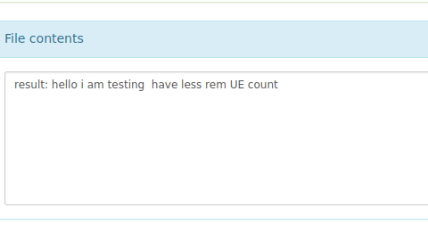
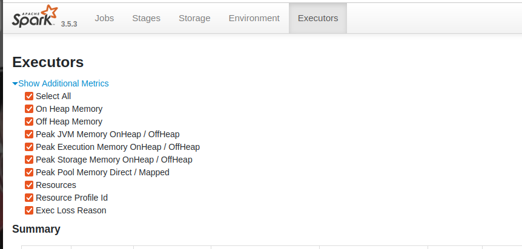

---
### name
>Lei Chen
### email
>lchen230@uic.edu

### netid
>lchen230
---


## Prerequiste
- linux ubuntu amd x86 64
- You need a hdfs system on your computer. My program will access your hdfs at : hdfs://localhost:9000
- You need to have spark installed and have access to spark history server at http://localhost:18080/
- you can launch the history server by : ``spark/sbin/start-history-server.sh ``
- you can follow the guide below to enable spark history server:
https://stackoverflow.com/questions/28675460/how-to-keep-the-spark-web-ui-alive
  - make sure u create a event directory to store finished spark jobs
``mkdir /tmp/spark-events``
## Instruction

## Video
https://youtu.be/2n5L30e5sGg
---

1. clone the repository into Intelliji IDE
2. On the terminal, run sbt.
3. run reload and then assembly inside the sbt shell
4. sbt assembly will produce the jar file called "cs441hw2.jar" which located at "target/scala-2.12/cs441hw2.jar"
5. create an empty directory and copy the jar file to that directory, so you can have a clean state to run the jar file. 
6. Upload "data.txt" and "tokenList.txt" to your hdfs system

````
hadoop fs -put data.txt /data.txt
hadoop fs -put tokenList.txt /tokenList.txt
````
7. run the following command to compute the dataset to train the model
````
spark-submit  --master local cs441hw2.jar data /data.txt /bin
````

8. run the following command to train the model
````
spark-submit  --master local cs441hw2.jar model /bin /model.zip /stats.txt
````
9. In your hdfs, you have produced "model.zip" which is the model.  **You can also access the training statistics at "stats.txt"**
10. We can test the model using the following command:
````
bin/spark-submit  --master local cs441hw2.jar generate /model.zip  "hello i am testing" /output.txt
````

11. output.txt will contain the word generation for the sentence "hello i am testing" using our model "model.zip". Here is the result:

12. now visit the history server at http://localhost:18080/
13. You will see 2 app name: data and model. 
    - data is generated when we run no.7
    - model is generated when we run no.8
    - we can find the duration of each job  on this tab.
14. Now click on the executor tab and press select all.

15. In this tab, we have 1 executor that ran 3 tasks.
In here we can find various spark metrics such as: Shuffle Read/Write:, memory usage, Data Shuffling and Partitioning Statistics 